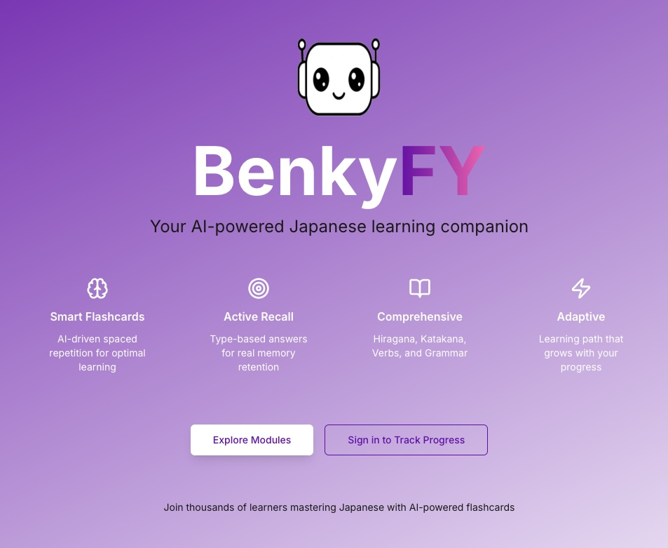
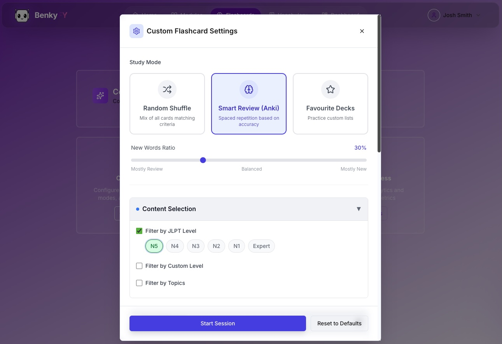
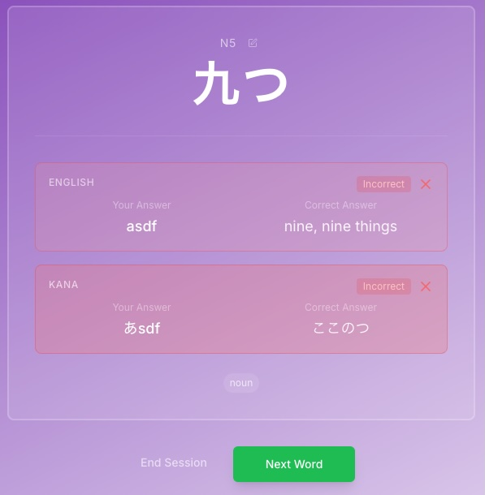
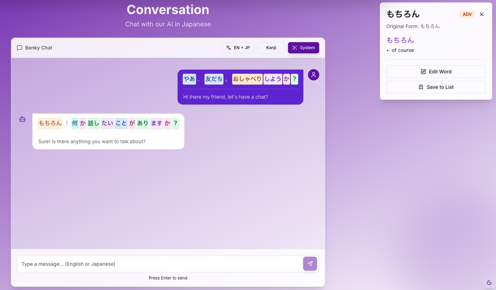
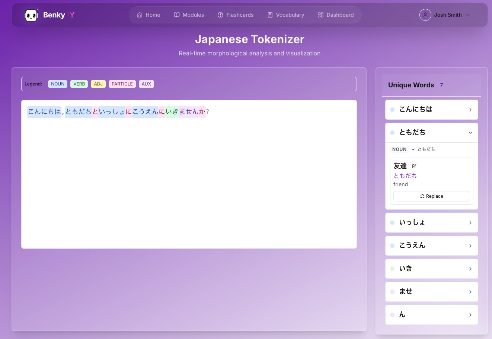

# BenkyFy 🇯🇵

> Your AI-powered Japanese language learning companion

BenkyFy is a comprehensive web application designed to accelerate Japanese language learning through intelligent flashcards, AI-powered conversations, and advanced tokenization tools. Built with modern web technologies and powered by AI, it provides an immersive learning experience tailored to your progress.



---

## ✨ Features

### 🎴 Smart Flashcards
Adaptive flashcard system with multiple study modes and intelligent spaced repetition.



**Key Features:**
- **Multiple Display Modes**: Study with English, Kana, or Kanji as the prompt
- **Flexible Input Types**: Practice writing in English, Romaji, Kana, or Kanji
- **Real-time Feedback**: Instant validation with visual indicators
- **Smart Retry System**: Up to 6 attempts with progressive hints
- **Session Statistics**: Track your progress and performance



**Study Sources:**
- Random word selection from your vocabulary
- Anki-style spaced repetition
- Custom learning lists you create

### 💬 AI Conversation Practice
Engage in natural conversations with an AI tutor that adapts to your level.



**Features:**
- Bilingual conversation display (Japanese ⇄ English)
- Real-time tokenization of responses
- Automatic vocabulary identification
- Click-to-learn unknown words
- Save new words directly to your vocabulary
- Multiple tokenization modes (AI vs System)

### 🔍 Advanced Tokenizer
Break down Japanese sentences to understand their structure.



**Capabilities:**
- Morphological analysis of Japanese text
- Part-of-speech tagging
- Lemma extraction
- Vocabulary lookup integration
- Export tokenized data

### 📚 Vocabulary Management
Build and organize your personal Japanese vocabulary database.

**Features:**
- Create custom word lists
- Import from various sources
- Track learning progress per word
- Associate words with JLPT levels
- Add personal notes and examples

### 📖 Lessons
Structured learning paths for Japanese fundamentals.

**Current Lessons:**
- Hiragana & Katakana mastery
- *(More lessons coming soon)*

---

## 🏗️ Architecture

BenkyFy is built as a full-stack application with the following components:

```
benky-fy/
├── frontend/          # Next.js 15 application
├── backend/           # Flask REST API
├── database/          # PostgreSQL with initialization scripts
├── nginx/             # Reverse proxy configuration
└── docker-compose.yml # Orchestration
```

### Tech Stack

**Frontend:**
- **Framework**: Next.js 15 (React 18)
- **Language**: TypeScript
- **Styling**: Tailwind CSS
- **UI Components**: shadcn/ui
- **State Management**: React Hooks
- **Authentication**: Google OAuth 2.0

**Backend:**
- **Framework**: Flask (Python)
- **Database**: PostgreSQL
- **ORM**: SQLAlchemy
- **Authentication**: JWT + OAuth
- **AI Integration**: Google Gemini API, Groq API
- **Japanese Processing**: MeCab/Sudachi tokenizer

**Infrastructure:**
- **Containerization**: Docker & Docker Compose
- **Reverse Proxy**: Nginx
- **Database**: PostgreSQL 15+

---

## 🚀 Getting Started

### Prerequisites

- Docker & Docker Compose
- Node.js 18+ (for local development)
- Python 3.11+ (for local development)

### Quick Start with Docker

1. **Clone the repository**
   ```bash
   git clone https://github.com/yourusername/benky-fy.git
   cd benky-fy
   ```

2. **Set up environment variables**
   ```bash
   cp .env.example .env
   # Edit .env with your configuration
   ```

   Required environment variables:
   ```env
   # Database
   DB_NAME=benkyfy_db
   DB_USER=benkyfy_user
   DB_PASSWORD=your_secure_password
   
   # Flask
   FLASK_SECRET_KEY=your_secret_key
   FLASK_ENV=development
   
   # Google OAuth
   GOOGLE_OAUTH_CLIENT_ID=your_client_id
   GOOGLE_OAUTH_CLIENT_SECRET=your_client_secret
   
   # AI APIs
   GOOGLE_GEMINI_API_KEY=your_gemini_key
   GROQ_API_KEY=your_groq_key
   
   # URLs
   NEXT_PUBLIC_API_URL=http://localhost:8080
   ALLOWED_ORIGINS=http://localhost:3000,http://localhost:80
   ```

3. **Start the application**
   ```bash
   docker-compose up -d
   ```

4. **Access the application**
   - Frontend: http://localhost:3000
   - Backend API: http://localhost:8080
   - Nginx Proxy: http://localhost:80

### Local Development

**Frontend:**
```bash
cd frontend
npm install
npm run dev
```

**Backend:**
```bash
cd backend
pip install -r requirements.txt
flask run --debug --port=8080
```

---

## 📱 Usage

1. **Sign up / Login** using Google OAuth
2. **Build your vocabulary** by adding words manually or through conversations
3. **Create custom lists** for focused study sessions
4. **Practice with flashcards** using your preferred display and input modes
5. **Chat with the AI** to practice natural conversation
6. **Analyze text** using the tokenizer to understand sentence structure

---

## 🗺️ Roadmap

- [ ] Grammar exercises with explanations
- [ ] Sentence composition practice
- [ ] Kanji writing practice with stroke order
- [ ] Audio pronunciation with speech recognition
- [ ] Mobile app (React Native)
- [ ] Community-shared vocabulary lists
- [ ] Progress analytics dashboard
- [ ] Offline mode support

---

## 🤝 Contributing

Contributions are welcome! Please feel free to submit a Pull Request.

1. Fork the repository
2. Create your feature branch (`git checkout -b feature/AmazingFeature`)
3. Commit your changes (`git commit -m 'Add some AmazingFeature'`)
4. Push to the branch (`git push origin feature/AmazingFeature`)
5. Open a Pull Request

---

## 📄 License

This project is licensed under the Apache License 2.0 - see the [LICENSE](LICENSE) file for details.

---

## 🙏 Acknowledgments

- Japanese language processing powered by MeCab/Sudachi
- AI capabilities provided by Google Gemini and Groq
- UI components from [shadcn/ui](https://ui.shadcn.com/)
- Inspired by the Japanese learning community

---

**Made with ❤️ for Japanese language learners**
